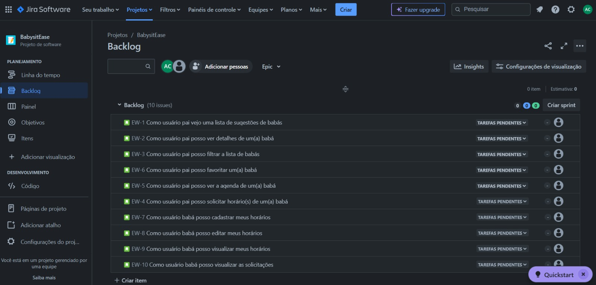
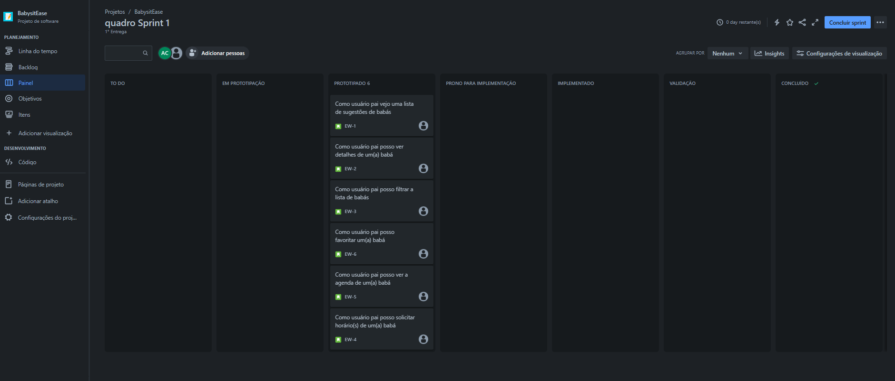
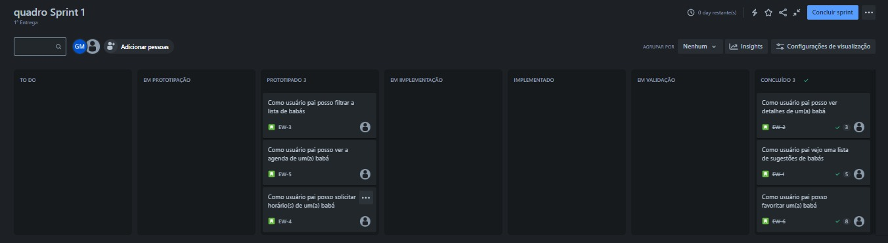

<html lang="pt-br">
<head>
    <meta charset="UTF-8">
    <meta name="viewport" content="width=device-width, initial-scale=1.0">
    <link rel="stylesheet" href="styles.css">
</head>
<body>
    

        <h2>Equipe: Mesa 6</h2>
        <ul>
            <li>Arthur Silva Capistrano</li>
            <li>Gabriel Tabosa</li>
            <li>Gheyson Melo</li>
            <li>João Antônio</li>
            <li>Rafael Danzi</li>
            <li>Thiago Manguinho</li>
        </ul>
    

    

        <h2>Produto: BabysitEase</h2>
        <h3>Descrição:</h3>
        
BabysitEase é uma plataforma inovadora que visa tornar o serviço de cuidar dos filhos mais seguro, confiável e acessível. Com BabysitEase, os pais podem encontrar facilmente babás qualificadas e confiáveis para cuidar de seus filhos, enquanto os babás têm acesso a um mercado mais amplo e oportunidades de emprego. Nosso objetivo é proporcionar tranquilidade aos pais, garantindo que seus filhos estejam em boas mãos, enquanto oferecemos suporte e oportunidades aos cuidadores. Com recursos de avaliação e qualificação, BabysitEase garante a excelência no cuidado infantil.

    

    

        <h2>Links :</h2>
        <ul>
            <li><a href="https://projeto-fds.atlassian.net/jira/software/projects/EW/boards/2">Link do Jira</a></li>
            <li><a href="https://www.figma.com/file/KL098ypwC8jrrPUnRASYJm?type=design">Link do Figma</a></li>
        </ul>
    

    

        <h2>1- Entrega</h2>
        <ul>
            <li><a href="https://www.youtube.com/watch?v=0sU1ZieJ0rc">Screencast</a></li>
            <h3>Quadro do Jira:</h3>
            
            
        </ul>
    
 
    

        <h2>2- Entrega</h2>
        <ul>
            <li><a href="https://www.youtube.com/watch?v=nnYU0FI4NGI">Screencast das três histórias</a></li>
            <li><a href="https://docs.google.com/document/d/1ZeMPv2CfbcyNhzv-Cb_9LR-AF1_GywFmJ9sGfoS8dUs/edit#heading=h.rrfpln9bkodr">Programação em Pares</a></li>
            <li><a href="https://drive.google.com/file/d/1ng_QaCN7MSW4OGo86d2r1XWkFQ5Gw56j/view?usp=sharing">Diagrama de Atividades</a></li>
            <h3>Quadro do Jira</h3>
             
            <h3> BugTracker: </h3>
            
        </ul>
    

</body>
</html>
