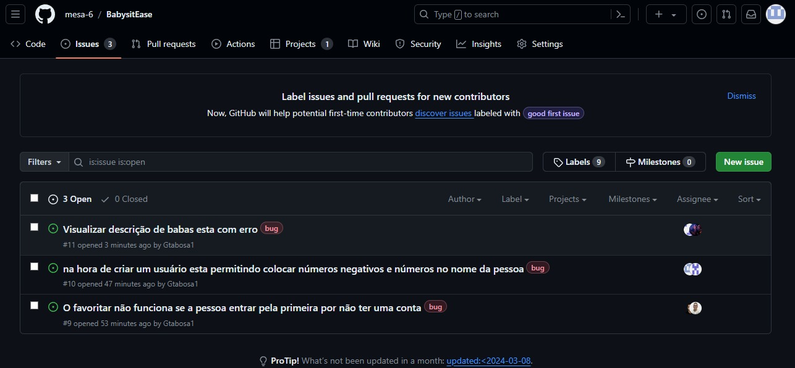

    

    
    
    

<h2>👩‍👧‍👦 BabysitEase</h2>
<h3>Descrição:</h3>

    BabysitEase é uma plataforma inovadora que visa tornar o serviço de cuidar dos filhos mais seguro, confiável e acessível. Com BabysitEase, os pais podem encontrar facilmente babás qualificadas e confiáveis para cuidar de seus filhos, enquanto os babás têm acesso a um mercado mais amplo e oportunidades de emprego. Nosso objetivo é proporcionar tranquilidade aos pais, garantindo que seus filhos estejam em boas mãos, enquanto oferecemos suporte e oportunidades aos cuidadores. Com recursos de avaliação e qualificação, BabysitEase garante a excelência no cuidado infantil.

<h2>🔗 Links Importantes:</h2>
<ul>
    <li><a href="https://projeto-fds.atlassian.net/jira/software/projects/EW/boards/2">Link do Jira</a></li>
    <li><a href="https://www.figma.com/file/KL098ypwC8jrrPUnRASYJm?type=design">Link do Figma</a></li>
    <li><a href= "https://docs.google.com/document/d/1ZeMPv2CfbcyNhzv-Cb_9LR-AF1_GywFmJ9sGfoS8dUs/edit#heading=h.owlmmn8nicl2">Pair Programing</a></li>
    <li><a href="https://www.canva.com/design/DAGBN2aJywo/PVQshni4un3jY-upetIfXg/edit?utm_content=DAGBN2aJywo&utm_campaign=designshare&utm_medium=link2&utm_source=sharebutton">Diagrama de atividades</a></li>
    <li><a href="https://babysitease.azurewebsites.net/">Site Azure</a></li>
</ul>

## ⚙ Tecnologias Utilizadas

| Categoria                   | Tecnologia                                                                           |
|-----------------------------|--------------------------------------------------------------------------------------|
| *Linguagem de Programação*  |  |
| *Banco de Dados*            |  |
| *Framework de Desenvolvimento* |  |
| *Frontend*                     |    |
| *Organização*                  |  |
|  *Aplicação*                  |  |

<h2>1- Entrega</h2>

<ul>
    <li><a href="https://www.youtube.com/watch?v=0sU1ZieJ0rc">Screencast</a></li>
    <h3>Quadro do Jira:</h3>
    
    
</ul>

<h2>2- Entrega</h2>

<ul>
    <li><a href="https://www.youtube.com/watch?v=nnYU0FI4NGI">Screencast das três histórias</a></li>
    <li><a href="https://docs.google.com/document/d/1ZeMPv2CfbcyNhz</a><li>
    <li><a href="https://babysitease-fds.azurewebsites.net/">Site Azure</a></li>
    <h3>Quadro do Jira</h3>
     
    <h3> BugTracker: </h3>
    
</ul>

<h2>3- Entrega</h2>

<ul>
    <!-- Detalhes da terceira entrega aqui -->
    <h2>Videos:</h2>
    <li><a href = "https://www.youtube.com/watch?v=WMOjSOUMBHc">ScreenCast Lo Fi</a></li>
    <li><a href = "https://youtu.be/NA8YYmMfT-4">ScreenCast Testes automatizados</a></li>
    <li><a href = "https://www.youtube.com/watch?v=uRCAzswGDLg">ScreenCast Azure</a></li>
    <li><a href = "https://www.youtube.com/watch?v=4GfzXZ1GFZY">ScreenCast CI/CD</a></li>
    <h2>Diagrama:</h2>
    <li><a href="https://www.canva.com/design/DAGBN2aJywo/PVQshni4un3jY-upetIfXg/edit?utm_content=DAGBN2aJywo&utm_campaign=designshare&utm_medium=link2&utm_source=sharebutton">Diagrama de atividades</a></li>
    <h2>Bug Tracker: </h2>
        
    <h2>Quadro Jira: </h2>
        
        
</ul>

<h2>4- Entrega</h2>

<ul>
    <!-- Detalhes da terceira entrega aqui -->
    <h2>Videos:</h2>
    <li><a href = "">ScreenCast Lo Fi</a></li>
    <li><a href = "">ScreenCast Testes automatizados</a></li>
    <li><a href = "">ScreenCast Azure</a></li>
    <li><a href = "">ScreenCast CI/CD</a></li>
    <h2>Diagrama:</h2>
    <li><a href="">Diagrama de atividades</a></li>
    <h2>Bug Tracker: </h2>
        
    <h2>Quadro Jira: </h2>
        
        
</ul>

    
<h2>👥 Equipe: Mesa 6</h2>
<ul>
    <li>Arthur Silva Capistrano</li>
    <li>Gabriel Tabosa</li>
    <li>Gheyson Melo</li>
    <li>João Antônio</li>
    <li>Rafael Danzi</li>
    <li>Thiago Manguinho</li>
</ul>

<h2>👩‍💻 Contribuintes Github</h2>

<h2> 📝 Licença</h2>

Este projeto está licenciado sob a [Licença MIT](LICENSE).
